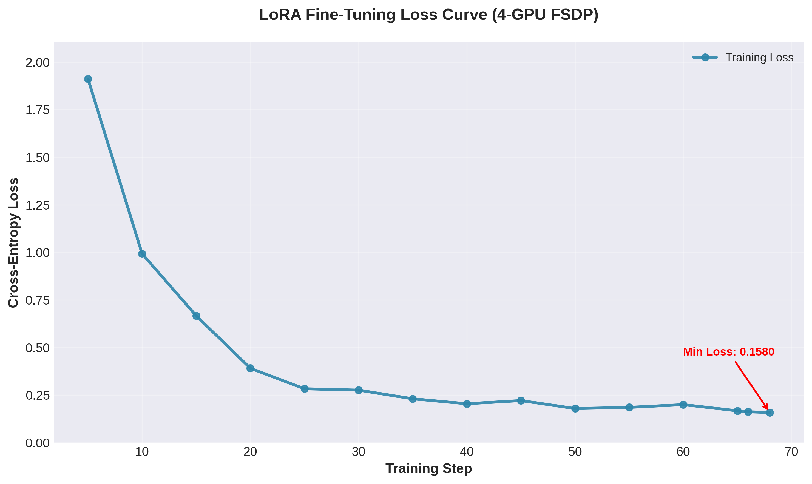
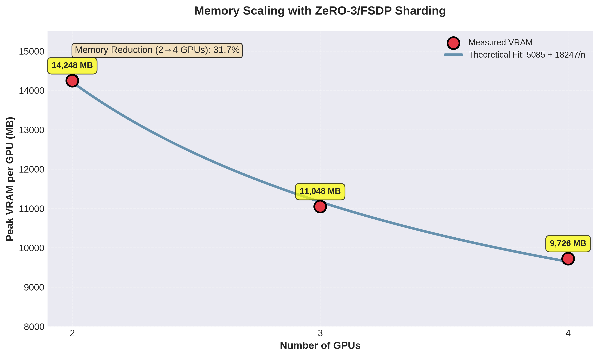
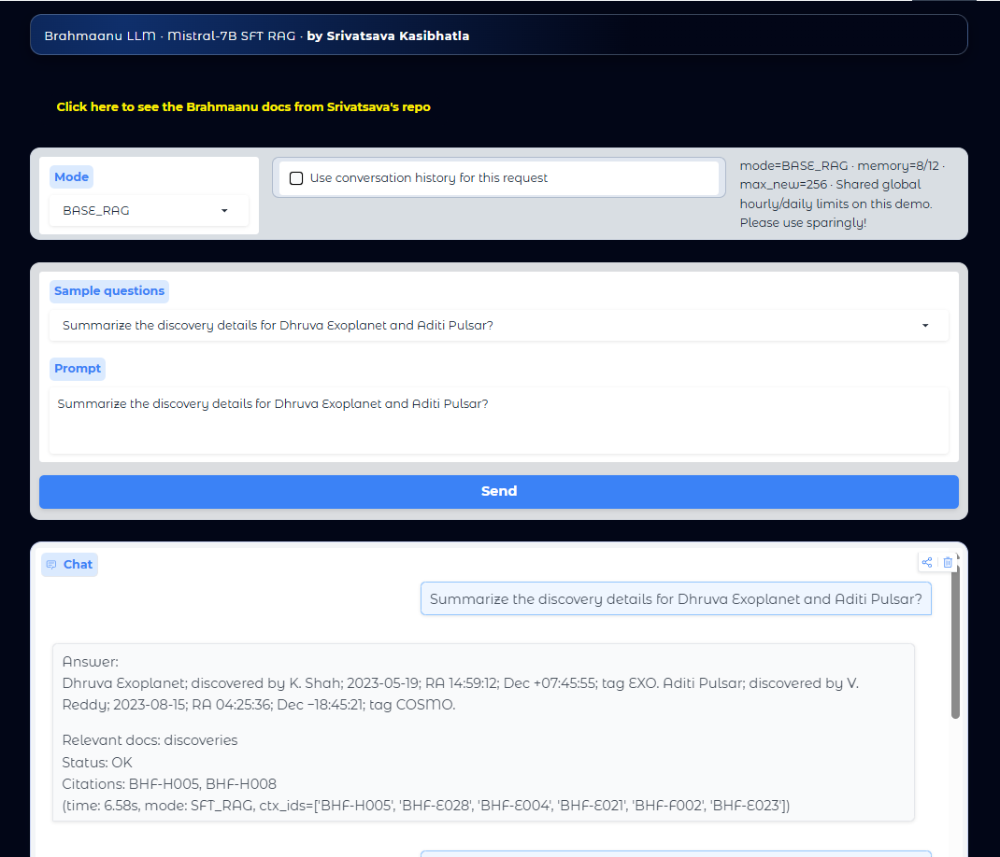

# 🌌 Brahmaanu LLM

**A Virtual Observatory Assistant Powered by Large Language Models**

[](https://www.python.org/downloads/)
[](https://pytorch.org/)
[](https://fastapi.tiangolo.com/)
[](LICENSE)
[](https://www.docker.com/)

> A research project demonstrating domain-specific AI assistant development through supervised fine-tuning, retrieval-augmented generation, and modern deployment practices.

---

## 📋 Table of Contents

- [Overview](#-overview)
- [Key Features](#-key-features)
- [Architecture](#-architecture)
- [Repository Structure](#-repository-structure)
- [Pipeline](#-pipeline)
- [Demo](#-demo)
- [Installation](#-installation)
- [Usage](#-usage)
- [Configuration](#-configuration)
- [Development Workflow](#-development-workflow)
- [Future Enhancements](#-future-enhancements)
- [Contributing](#-contributing)
- [License](#-license)
- [Contact](#-contact)

---

## 🔭 Overview

Brahmaanu LLM is an advanced virtual observatory assistant designed for astronomers and engineers at the Brahmaanu Space Observatory. This project showcases the integration of:

- **Supervised Fine-Tuning (SFT)** of Mistral-7B-Instruct v0.3 using LoRA
- **Retrieval-Augmented Generation (RAG)** with hybrid search (BM25 + dense retrieval)
- **Multi-GPU Training** with PyTorch FSDP and ZeRO-3 optimization
- **Production-Ready API** built with FastAPI and Gradio
- **Containerized Deployment** via Docker and GHCR

The system combines the reasoning capabilities of large language models with precise fact retrieval from observatory documentation, providing accurate, citation-backed responses to domain-specific queries.

---

## ✨ Key Features

### 🎯 **Domain-Specific Intelligence**
- Fine-tuned on curated Q&A pairs from observatory operations, instruments, calibration procedures, and discoveries
- Supports multiple inference modes: SFT+RAG, SFT-only, Base+RAG, Base-only

### 🔍 **Advanced Retrieval System**
- Hybrid search combining BM25 (lexical) and dense embeddings (BAAI/bge-large-en-v1.5)
- Cross-encoder reranking with BAAI/bge-reranker-base
- Maximum Marginal Relevance (MMR) for diverse result selection
- Fact-tagged citations with unique identifiers (e.g., `[BHF-D021]`)

### ⚡ **Scalable Training Infrastructure**
- LoRA fine-tuning for parameter-efficient adaptation
- Automatic FSDP with ZeRO-3 for multi-GPU setups (2-4 GPUs)
- QLoRA fallback for single-GPU memory efficiency
- Comprehensive logging of training metrics and VRAM usage

### 🚀 **Production-Ready Deployment**
- FastAPI endpoints with rate limiting (per-session, per-IP, global)
- Interactive Gradio UI with citation pop-overs and context highlighting
- GGUF model conversion for optimized inference
- Docker container published to GitHub Container Registry

---

## 🏗️ Architecture

```
┌─────────────────┐
│  User Interface │
│   (Gradio UI)   │
└────────┬────────┘
         │
         ▼
┌─────────────────┐
│   FastAPI API   │
│  Rate Limiting  │
└────────┬────────┘
         │
    ┌────┴─────┐
    ▼          ▼
┌────────┐  ┌──────────┐
│  RAG   │  │  Model   │
│ Engine │  │ Mistral  │
└────────┘  │  7B-SFT  │
    │       └──────────┘
    ▼
┌──────────────────┐
│  Faiss Index     │
│  BM25 + Dense    │
│  Cross-Encoder   │
└──────────────────┘
```

---

## 📁 Repository Structure

```
brahmaanu_llm/
├── app/                      # Inference server & UI
│   ├── main_gradio.py       # Gradio chat interface
│   ├── api.py               # FastAPI endpoints
│   └── ratelimits.py        # Rate limiting logic
├── configs/                  # Configuration files
│   ├── sft_config.py        # Fine-tuning hyperparameters
│   ├── rag_config.py        # RAG settings
│   └── app_config.py        # Application settings
├── data/                     # Training & retrieval data
│   ├── raw/
│   │   ├── questions/       # Q&A JSON files
│   │   └── docs/            # Primary documents (fact-tagged)
│   └── processed/
│       ├── df_sft_train.parquet
│       └── df_sft_eval.parquet
├── rag/                      # RAG implementation
│   ├── rag_pipeline.py      # Indexing & retrieval
│   ├── chunking.py          # Document chunking
│   └── reranking.py         # Cross-encoder reranking
├── training/                 # Training scripts
│   ├── train.py             # Main training loop
│   ├── data_prep.py         # Data preprocessing
│   └── evaluation.py        # Metrics & logging
├── Dockerfile               # Container build definition
├── requirements.txt         # Python dependencies
└── README.md               # This file
```

---

## 🔄 Pipeline

### 1️⃣ **Data Preparation**
- Curate Q&A pairs from internal observatory documents
- Tag facts with unique identifiers for precise citations
- Store processed datasets as Parquet files for efficient loading

### 2️⃣ **Supervised Fine-Tuning**
- Fine-tune Mistral-7B-Instruct v0.3 using LoRA adapters
- Multi-GPU: FSDP + ZeRO-3 for distributed training
- Single-GPU: QLoRA for memory efficiency
- Log training metrics, loss curves, and VRAM usage

### 3️⃣ **Model Conversion & Packaging**
- Merge LoRA weights with base model
- Convert to GGUF format for optimized inference
- Build Docker container with cached models
- Publish to GHCR with `:prod` tag

### 4️⃣ **RAG Index Building**
- Chunk documents into fact-based or token-based units
- Embed chunks using BAAI/bge-large-en-v1.5
- Build Faiss index for dense retrieval
- Construct BM25 index for lexical matching

### 5️⃣ **Inference & Deployment**
- Load fine-tuned model with optional LoRA adapter
- Initialize RAG pipeline with hybrid search
- Expose FastAPI endpoints with rate limiting
- Serve Gradio UI for interactive chat

---

## ⚠️ Data Availability Notice

> **Important:** This repository currently includes the full Q&A training pairs and primary documents for transparency and reproducibility. However, **model checkpoints, trained adapters, and training artifacts (loss curves, VRAM logs, etc.) are not yet published** due to storage and hosting constraints. These will be made available in future releases or upon request for research collaboration.

---

## 📊 Evaluation Metrics

The following metrics were computed on a held-out test set across four inference modes:

| Mode | Schema Valid Rate | Key Exact Rate | Citations Format Rate | Status Valid Rate | Answer Exact Rate | Answer Token F1 | Citations F1 |
|------|-------------------|----------------|----------------------|-------------------|-------------------|-----------------|--------------|
| **BASE + RAG** | 1.0 | 1.0 | 1.0 | 1.0 | 0.586 | 0.881 | 0.793 |
| **SFT + RAG** | 1.0 | 1.0 | 1.0 | 1.0 | 0.565 | 0.880 | 0.793 |
| **BASE** | 0.120 | 0.917 | 0.120 | 0.942 | 0.0 | 0.103 | 0.0 |
| **SFT** | 1.0 | 1.0 | 1.0 | 1.0 | 0.747 | 0.853 | 0.214 |

### Key Findings

- **RAG Modes** (BASE+RAG, SFT+RAG) achieve perfect structural validity (schema, key format, citations format) and high citation F1 scores (~0.79), demonstrating robust fact attribution
- **SFT-only** mode shows the highest answer exact rate (0.747) but lower citation F1 (0.214), indicating it generates accurate answers but with fewer precise fact tags
- **BASE-only** mode struggles without fine-tuning or retrieval, with near-zero answer accuracy and poor citation capability
- **Answer Token F1** scores (0.85-0.88) across RAG and SFT modes indicate strong semantic overlap with ground truth, even when exact matches differ

The metrics validate that combining supervised fine-tuning with retrieval augmentation provides the best balance of accuracy, citation quality, and structural reliability.

---

## 📈 Training & Performance Visualizations

### SFT Training Loss Curve

*Training and validation loss over 3 epochs showing convergence of the LoRA fine-tuning process.*

### Memory Scaling with ZeRO-3

*Peak VRAM usage per GPU when scaling from 1 to 4 GPUs using FSDP with ZeRO-3 optimization. Demonstrates efficient memory distribution across devices.*

### Chat Interface Examples

*Screenshot of the Gradio interface showing multi-turn conversation with citation pop-overs and context highlighting.*

### Sample Conversation Snippet

*Example interaction demonstrating RAG-retrieved fact citations with unique identifiers (e.g., [BHF-D021]) embedded in responses.*

> **Note:** All visualizations are generated from actual training runs and inference sessions. Place image files in an `assets/` directory in your repository root.

---

## 🎬 Demo

### 🌐 **Live UI** (Demo Only)
**[Access Demo Interface →](https://your-demo-url.com)**

> **Note:** This is a demonstration interface only. No live model is running on the backend. For full functionality, please run the application locally or use the API endpoints.

### 📹 **Video Demo**
**[Watch Video Demonstration →](https://your-video-url.com)**

The video showcases:
- Interactive chat with citation pop-overs
- Multi-mode inference (SFT+RAG, Base+RAG, etc.)
- Real-time fact retrieval and context highlighting
- Admin dashboard with metrics

---

## 💻 Installation

### Prerequisites
- Python 3.10+
- Docker (optional, for containerized deployment)
- CUDA-capable GPU (recommended for training/inference)

### Option 1: Docker (Recommended)

```bash
# Pull the pre-built image
docker pull ghcr.io/ksv2001/brahmaanu_llm:prod

# Run the container
docker run -p 8080:8080 -p 7861:7861 \
  -v $(pwd)/cache:/cache/hf \
  ghcr.io/ksv2001/brahmaanu_llm:prod
```

### Option 2: Local Installation

```bash
# Clone the repository
git clone https://github.com/KSV2001/brahmaanu_llm.git
cd brahmaanu_llm

# Create virtual environment
python -m venv venv
source venv/bin/activate  # On Windows: venv\Scripts\activate

# Install dependencies
pip install -r requirements.txt

# Set environment variables
export HF_HOME=/path/to/cache
export TRANSFORMERS_CACHE=/path/to/cache
```

---

## 🚀 Usage

### Running the API Server

```bash
# Using Docker
docker run -p 8080:8080 ghcr.io/ksv2001/brahmaanu_llm:prod

# Using Python directly
python -m app.api --host 0.0.0.0 --port 8080
```

### Running the Gradio UI

```bash
python -m app.main_gradio
```

Access the interface at `http://localhost:7861`

### API Endpoints

#### **POST /chat**
```bash
curl -X POST http://localhost:8080/chat \
  -H "Content-Type: application/json" \
  -d '{
    "user_msg": "What are the calibration procedures for the primary detector?",
    "chat_history": [],
    "mode": "SFT_RAG",
    "use_history": true,
    "state": {}
  }'
```

#### **GET /sample_questions**
```bash
curl http://localhost:8080/sample_questions
```

### Training the Model

```bash
# Single GPU (QLoRA)
python training/train.py --config configs/sft_config.py

# Multi-GPU (FSDP + ZeRO-3)
torchrun --nproc_per_node=4 training/train.py --config configs/sft_config.py
```

---

## ⚙️ Configuration

### Fine-Tuning Parameters (`configs/sft_config.py`)

```python
SFT_CONFIG = {
    "model_name": "mistralai/Mistral-7B-Instruct-v0.3",
    "max_seq_length": 2048,
    "batch_size": 4,
    "learning_rate": 2e-4,
    "num_epochs": 3,
    "lora_rank": 16,
    "lora_alpha": 32,
    "lora_dropout": 0.05
}
```

### RAG Parameters (`configs/rag_config.py`)

```python
RAG_CONFIG = {
    "embedding_model": "BAAI/bge-large-en-v1.5",
    "reranker_model": "BAAI/bge-reranker-base",
    "chunk_size": 512,
    "top_k_retrieval": 20,
    "top_k_rerank": 5,
    "mmr_diversity": 0.3
}
```

---

## 🔧 Development Workflow

This project was developed using a hybrid approach combining:

- **Manual Engineering**: Core architecture, training loops, and API design
- **AI-Assisted Development**: ChatGPT-5 and Claude for code refinement, documentation, and debugging
- **Iterative Validation**: Unit tests, metric plotting, and hyperparameter tuning
- **Modular Refactoring**: Notebook prototypes converted to production-ready modules

### Training Metrics

Training logs are saved to `TRAIN_LOGS.csv` with the following metrics:
- Training loss per epoch
- Evaluation loss and perplexity
- VRAM usage per GPU (ZeRO-3 mode)
- Throughput (tokens/second)

### Evaluation

The model is evaluated on:
- Held-out Q&A test set
- BLEU/ROUGE scores for answer quality
- Citation accuracy (percentage of correctly attributed facts)
- Human evaluations from domain experts

---

## 🔮 Future Enhancements

- [ ] **Diagrams**: Excalidraw flowcharts for RAG retrieval logic and training pipeline
- [ ] **Benchmarks**: Comparative evaluation against GPT-4, Claude, and other baselines
- [ ] **Live Deployment**: Hugging Face Space with public API access
- [ ] **Multi-Modal**: Support for image/plot understanding from observatory data
- [ ] **Streaming Responses**: Server-sent events (SSE) for real-time token generation
- [ ] **Fine-Grained Access Control**: Role-based permissions for different user types

---

## 🤝 Contributing

Contributions are welcome! Please follow these steps:

1. Fork the repository
2. Create a feature branch (`git checkout -b feature/amazing-feature`)
3. Commit your changes (`git commit -m 'Add amazing feature'`)
4. Push to the branch (`git push origin feature/amazing-feature`)
5. Open a Pull Request

### Development Guidelines
- Follow PEP 8 style guidelines
- Add unit tests for new features
- Update documentation for API changes
- Run `pytest` before submitting PRs

---

## 📄 License

This project is licensed under the MIT License - see the [LICENSE](LICENSE) file for details.

---

## 📧 Contact

**Project Maintainer**: [Your Name](mailto:your.email@example.com)

**Project Repository**: [github.com/KSV2001/brahmaanu_llm](https://github.com/KSV2001/brahmaanu_llm)

**Hugging Face Models**: [huggingface.co/KSV2001](https://huggingface.co/KSV2001)

---

## 🙏 Acknowledgments

- **Mistral AI** for the base Mistral-7B-Instruct model
- **Beijing Academy of Artificial Intelligence (BAAI)** for BGE embeddings and rerankers
- **Hugging Face** for the Transformers library and model hosting
- **FastAPI** and **Gradio** teams for excellent framework support
- **PyTorch** team for FSDP and distributed training capabilities

---

<div align="center">

**⭐ Star this repository if you find it useful!**

Made with ❤️ for the astronomical research community

</div>